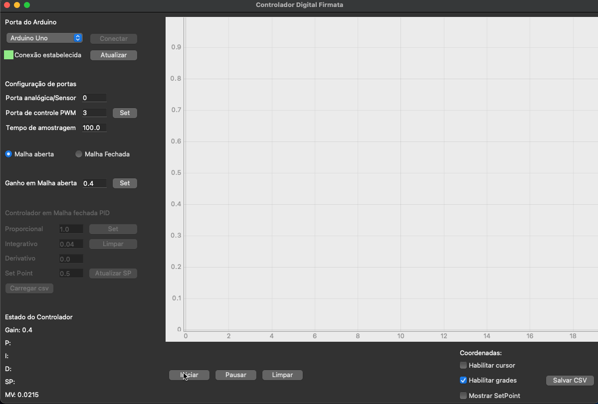

 

The Firmata digital controller is an educational control software used in conjunction with an Arduino board.

This software was developed with the intent of being used in practical control classes, and with it, it is possible to perform open-loop and closed-loop tests using PID.

More info on project's [github](https://github.com/luizborgess/controlador-digital-firmata).

