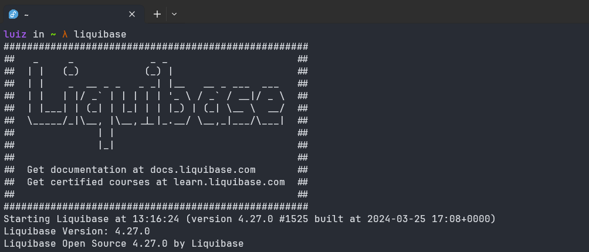

<a  href="https://copr.fedorainfracloud.org/coprs/luiz-b/liquibase/package/liquibase/"></a>
<br>

This is my first project in Copr, when i tried to install liquibase, got to unzip, create symlink, and why not to pack it inside a rpm, and just type dnf install liquibase

Follow bellow the readme that you can find in my [github repo](https://github.com/luizborgess/liquibase-rpm):


A simple project to package most recent liquibase version into rpm package.

With a simple

```
dnf copr enable luiz-b/liquibase
dnf install liquibase
```

Install liquibase and create a symlink in bin folder.

And thats it:


